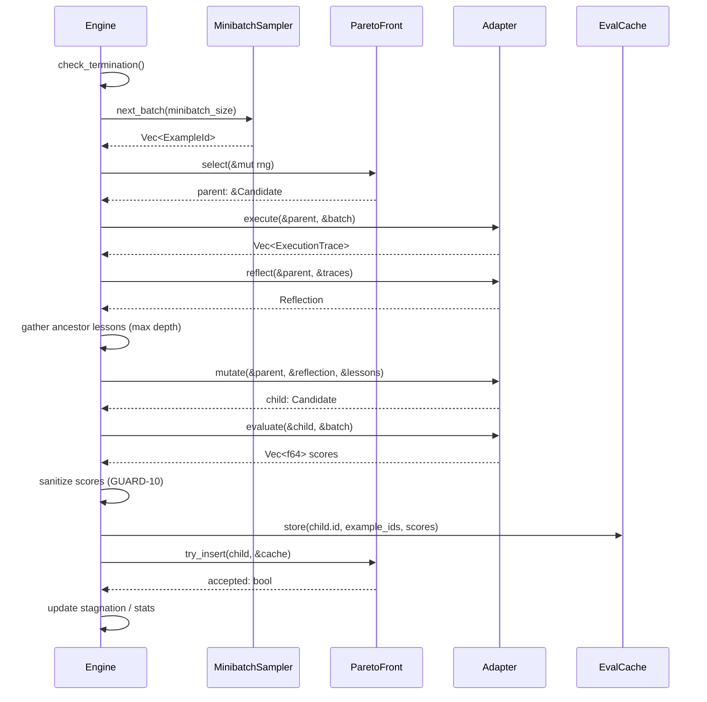

# Design: GEPA Core Engine

## 1. Overview

The Core Engine orchestrates the GEPA optimization loop: Select → Execute → Reflect → Mutate → Evaluate → Accept/Reject. It owns the main `run()` future, drives minibatch cycling, enforces termination conditions, and delegates all LLM interaction to the adapter trait.

The engine uses a typestate builder pattern for compile-time validation of required fields, a single-threaded async loop with cooperative cancellation, and epoch-based minibatch sampling with seeded RNG for determinism (GUARD-9). The loop is intentionally sequential — one iteration at a time, one adapter call at a time — to keep the algorithm deterministic and debuggable.

**Satisfies:** GOAL-1.0 through GOAL-1.12, with cross-references to GOAL-2.x (Pareto front), GOAL-3.x (adapter), GOAL-7.x (config), GOAL-8.x (data loading).

## 2. Components

### 2.1 GEPAEngineBuilder

**Responsibility:** Construct a validated `GEPAEngine` with compile-time enforcement of required fields via typestate generics.

**Interface:**

```rust
pub struct GEPAEngineBuilder<A, D, S>
where
    A: sealed::AdapterState,
    D: sealed::DataLoaderState,
    S: sealed::SeedsState,
{
    config: GEPAConfig,
    adapter: A,
    data_loader: D,
    seeds: S,
    cancellation_token: Option<CancellationToken>,
    rng_seed: Option<u64>,
}

mod sealed {
    pub trait AdapterState {}
    pub trait DataLoaderState {}
    pub trait SeedsState {}
    pub struct Missing;
    pub struct Set<T>(pub T);
    impl AdapterState for Missing {}
    impl<T: GEPAAdapter> AdapterState for Set<T> {}
    impl DataLoaderState for Missing {}
    impl<T: DataLoader> DataLoaderState for Set<T> {}
    impl SeedsState for Missing {}
    impl SeedsState for Set<Vec<Candidate>> {}
}

impl GEPAEngineBuilder<Missing, Missing, Missing> {
    pub fn new(config: GEPAConfig) -> Self;
}

impl<D: DataLoaderState, S: SeedsState> GEPAEngineBuilder<Missing, D, S> {
    pub fn adapter<A: GEPAAdapter>(self, adapter: A) -> GEPAEngineBuilder<Set<A>, D, S>;
}

impl<A: AdapterState, S: SeedsState> GEPAEngineBuilder<A, Missing, S> {
    pub fn data_loader<D: DataLoader>(self, loader: D) -> GEPAEngineBuilder<A, Set<D>, S>;
}

impl<A: AdapterState, D: DataLoaderState> GEPAEngineBuilder<A, D, Missing> {
    pub fn seeds(self, seeds: Vec<Candidate>) -> GEPAEngineBuilder<A, D, Set<Vec<Candidate>>>;
}

impl<A: GEPAAdapter, D: DataLoader> GEPAEngineBuilder<Set<A>, Set<D>, Set<Vec<Candidate>>> {
    pub fn cancellation_token(self, token: CancellationToken) -> Self;
    pub fn build(self) -> Result<GEPAEngine<A, D>, GEPAError>;
}
```

**Key Details:**
- Typestate generics `(Missing, Set<T>)` ensure `.build()` is only callable when adapter, data_loader, and seeds are all provided — compile error otherwise.
- `build()` validates: seeds non-empty, all seeds have matching parameter keys, at least one text parameter per seed (GOAL-5.1). Config-only validation already happened in `GEPAConfig::new()` (GOAL-7.3).
- `cancellation_token()` is optional — if not set, the engine runs until another termination condition fires (GOAL-1.11).
- RNG seed is read from `config.rng_seed`: if `Some(seed)`, deterministic; if `None`, random seed generated and stored for reproducibility.

**Satisfies:** GOAL-1.0

### 2.2 GEPAEngine::run() — Main Optimization Loop

**Responsibility:** Execute the full GEPA optimization loop until a termination condition is met.

**Interface:**

```rust
pub struct GEPAEngine<A: GEPAAdapter, D: DataLoader> {
    config: GEPAConfig,
    adapter: A,
    data_loader: D,
    state: GEPAState,
    rng: StdRng,
    cancellation_token: Option<CancellationToken>,
    start_time: Option<Instant>,
    consecutive_skips: u32,
}

impl<A: GEPAAdapter, D: DataLoader> GEPAEngine<A, D> {
    pub async fn run(&mut self) -> Result<GEPAResult, GEPAError>;
    pub async fn run_from_state(&mut self, state: GEPAState) -> Result<GEPAResult, GEPAError>;
}
```

**Iteration pseudocode (one loop cycle):**

1. **Check termination** (§2.3) — max iterations, time budget, stagnation, consecutive skips, cancellation.
2. **Sample minibatch** (§2.4) — draw next `minibatch_size` examples from epoch cycle.
3. **Select** — call `ParetoFront::select(&mut self.rng)` to pick parent candidate (GOAL-1.3, delegates to Feature 02 §2.3).
4. **Execute** — call `adapter.execute(&parent, &minibatch).await`; on error, enter retry logic (§2.5). On exhaustion, skip iteration.
5. **Reflect** — call `adapter.reflect(&parent, &traces).await`; retry on error.
6. **Mutate** — gather ancestor lessons via `state.lineage(parent.id)` (max `config.max_lesson_depth`), call `adapter.mutate(&parent, &reflection, &lessons).await`; retry on error.
7. **Evaluate** — call `adapter.evaluate(&child, &minibatch).await`; retry on error. Sanitize scores per GUARD-10 (NaN → None, ±Inf → clamped).
8. **Accept/Reject** — store child scores in evaluation cache (GOAL-6.3). Check if child dominates parent on shared examples. If yes (or parent not on front), insert child into Pareto front; prune dominated members (delegates to Feature 02 §2.2). Reset stagnation counter. If rejected, increment stagnation counter (GOAL-1.2b).
9. **Checkpoint** — if `iteration % checkpoint_interval == 0`, write state atomically (GOAL-6.2).
10. **Re-evaluate** — if `iteration % re_eval_interval == 0`, run backfill (GOAL-8.5a), recompute front (GOAL-8.5b), compute overfitting delta (GOAL-8.5c).
11. **Merge** (optional) — if merge enabled and `iteration % merge_interval == 0`, run merge iteration: select two complementary candidates, execute both, call `adapter.merge()`, evaluate, accept/reject (GOAL-1.10).
12. **Increment iteration**, update statistics, loop.

After loop exit: evaluate all front candidates on validation set (GOAL-8.6), build `GEPAResult`.

**Satisfies:** GOAL-1.1, GOAL-1.3, GOAL-1.4, GOAL-1.5, GOAL-1.6, GOAL-1.7a-d, GOAL-1.8, GOAL-1.9, GOAL-1.10, GOAL-1.12

### 2.3 Termination Logic

**Responsibility:** Check all stopping conditions at the top of each iteration and after each adapter call.

**Interface:**

```rust
#[derive(Debug, Clone, Serialize, Deserialize, PartialEq, Eq)]
pub enum TerminationReason {
    MaxIterations,
    TimeBudget,
    Stagnation,
    TooManySkips,
    Cancelled,
}

impl<A: GEPAAdapter, D: DataLoader> GEPAEngine<A, D> {
    fn check_termination(&self) -> Option<TerminationReason>;
}
```

**Check order (evaluated top-to-bottom, first match wins):**

1. **Cancellation** — `self.cancellation_token.as_ref().map_or(false, |t| t.is_cancelled())` → `Cancelled`. Checked at iteration start AND after each adapter call (GOAL-1.11).
2. **Max iterations** — `self.state.iteration >= self.config.max_iterations` → `MaxIterations` (GOAL-1.2a).
3. **Time budget** — `self.start_time.unwrap().elapsed() >= self.config.time_budget.unwrap()` → `TimeBudget` (GOAL-1.2a, GOAL-7.6). Checked before Select; an in-progress iteration runs to completion.
4. **Too many skips** — `self.consecutive_skips >= self.config.max_consecutive_skips` → `TooManySkips` (GOAL-1.2c).
5. **Stagnation** — `self.state.stagnation_counter >= self.config.stagnation_limit` → `Stagnation` (GOAL-1.2b). Counter increments only on actual reject (not skips).

**Satisfies:** GOAL-1.2a, GOAL-1.2b, GOAL-1.2c, GOAL-1.2d

### 2.4 Minibatch Cycling

**Responsibility:** Provide epoch-based minibatch sampling ensuring every training example is seen before any reuse.

**Interface:**

```rust
pub struct MinibatchSampler {
    example_ids: Vec<String>,
    shuffled_order: Vec<usize>,
    cursor: usize,
    epoch: u64,
}

impl MinibatchSampler {
    pub fn new(example_ids: Vec<String>, rng: &mut StdRng) -> Self;
    pub fn next_batch(&mut self, batch_size: usize, rng: &mut StdRng) -> Vec<String>;
}
```

**Key Details:**

- On construction, `shuffled_order` is a random permutation of `0..example_ids.len()` generated by the seeded RNG (GUARD-9).
- `next_batch(batch_size)` reads `batch_size` indices starting at `cursor`. If fewer than `batch_size` remain in the current epoch, it takes the remainder, increments `epoch`, generates a new shuffled permutation, and fills the rest from the new epoch (GOAL-8.3 epoch boundary behavior).
- If `batch_size >= example_ids.len()`, returns all examples (full-batch mode). No padding or duplication (GOAL-8.3 edge case).
- `cursor` and `epoch` are serializable for checkpoint/resume.
- Returns `Vec<String>` of example IDs; the engine resolves to full `Example` structs from the `DataLoader`'s cached examples.

**Satisfies:** GOAL-1.4, GOAL-8.3

### 2.5 Error Handling Within the Loop

**Responsibility:** Implement retry logic for adapter calls and manage skip/halt decisions.

**Interface:**

```rust
impl<A: GEPAAdapter, D: DataLoader> GEPAEngine<A, D> {
    async fn call_with_retry<T, F, Fut>(
        &self,
        operation_name: &str,
        f: F,
    ) -> Result<T, IterationOutcome>
    where
        F: Fn() -> Fut,
        Fut: Future<Output = Result<T, GEPAError>>;
}

pub enum IterationOutcome {
    Skipped { reason: String },
    Halt { error: GEPAError },
    Cancelled,
}
```

**Key Details:**

- Wraps every adapter call. On `Err(GEPAError::AdapterError { retryable: false, .. })`, immediately returns `Skipped` or `Halt` (per `config.error_policy`). Non-retryable errors never consume retry budget.
- On `Err(GEPAError::RateLimited { retry_after })`, waits `max(retry_after.unwrap_or(0), computed_backoff)` then retries. Backoff: exponential = `base_delay * 2^attempt`, capped at `max_retry_delay` (GOAL-7.5).
- On `Err(GEPAError::Timeout)`, retries with normal backoff.
- After exhausting `config.retry_max` retries: if `ErrorPolicy::Skip`, returns `Skipped`; if `ErrorPolicy::Halt`, returns `Halt`.
- On `Skipped`: engine increments `consecutive_skips`, increments `state.stats.skipped_iterations`, does NOT increment stagnation counter (GOAL-1.2b). On next successful iteration, `consecutive_skips` resets to 0.
- Between retries, checks cancellation token. If cancelled, returns `Cancelled` immediately.
- All retry attempts are logged via the event system.

**Satisfies:** GOAL-1.2b (skip/stagnation interaction), GOAL-1.2c (TooManySkips), GOAL-7.5

### 2.6 CancellationToken Integration

**Responsibility:** Cooperative cancellation that never aborts a mid-flight adapter call.

**Interface:**

```rust
#[derive(Clone)]
pub struct CancellationToken {
    inner: Arc<AtomicBool>,
}

impl CancellationToken {
    pub fn new() -> Self;
    pub fn cancel(&self);
    pub fn is_cancelled(&self) -> bool;
}
```

**Key Details:**

- Simple `Arc<AtomicBool>` wrapper — `Clone + Send + Sync + 'static` (GOAL-1.11).
- Checked at three points: (1) top of each iteration in `check_termination()`, (2) between retry attempts in `call_with_retry()`, (3) after each adapter call returns.
- The engine never `.abort()` an adapter future. It awaits the current call to completion, then checks the token. This ensures adapter implementations can rely on running to completion (no half-written state).
- If the user does not provide a token, a default no-op token (always `false`) is used internally — avoids `Option` checks in the hot loop.
- When triggered, the engine finishes the current adapter call, skips remaining steps, sets `TerminationReason::Cancelled`.

**Satisfies:** GOAL-1.11, GOAL-1.2c

## 3. Data Flow Within One Iteration



The diagram shows the sequential flow within a single iteration. Every adapter call goes through `call_with_retry()` (§2.5), which is omitted for clarity. Score sanitization (NaN → None, ±Inf → clamped) happens before cache storage per GUARD-10. The Pareto front update (Feature 02 §2.2) checks dominance using scores from the evaluation cache.

## 4. Integration Points

| This Feature | Depends On | Interface |
|---|---|---|
| §2.2 run() step 3 (Select) | Feature 02 §2.3 | `ParetoFront::select(&mut rng) -> &Candidate` |
| §2.2 run() step 8 (Accept) | Feature 02 §2.2 | `ParetoFront::try_insert(candidate, &cache) -> bool` |
| §2.2 run() steps 4-7 | Feature 03 §2.1 | `GEPAAdapter::{execute, reflect, mutate, evaluate}` |
| §2.4 minibatch sampling | Feature 08 (Data Loading) | `DataLoader::training_examples() -> Vec<Example>` |
| §2.2 run() step 8 (cache) | Feature 06 §GOAL-6.3 | `EvalCache::store(candidate_id, example_id, score)` |
| §2.1 builder config | Feature 07 (Config) | `GEPAConfig` with all stopping criteria, retry policy |
| §2.2 run() checkpointing | Feature 06 §GOAL-6.2 | `GEPAState::serialize()`, atomic file write |
