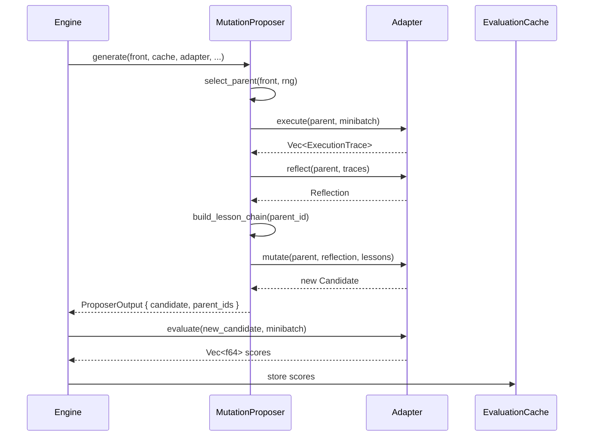

# Design: GEPA Proposers

## 1. Overview

Proposers are the candidate generation mechanism within the GEPA engine. The engine delegates the Execute → Reflect → Mutate pipeline to a **MutationProposer** (primary, every iteration) and optionally a **MergeProposer** (secondary, periodic). Proposers never call LLMs directly — they orchestrate adapter method calls and manage the ancestor lesson chain, selection tracking, and complementary pair selection.

The key design trade-off is keeping proposers stateful enough to enforce round-robin selection fairness (GOAL-4.3) while remaining serializable for checkpoint/resume. All randomness flows through a `&mut R: Rng` parameter to satisfy GUARD-9 determinism.

**Addresses:** GOAL-4.1, GOAL-4.2, GOAL-4.2b, GOAL-4.3, GOAL-4.4, GOAL-4.5

## 2. Components

### 2.1 Proposer Trait

**Responsibility:** Define the common interface for all candidate-generation strategies.

**Interface:**
```rust
use async_trait::async_trait;

/// Marker trait for proposer output context. MutationProposer produces one
/// candidate; MergeProposer produces one candidate from two parents.
#[async_trait]
pub trait Proposer: Send + Sync + std::fmt::Debug {
    /// Generate a new candidate. The engine passes in mutable references to
    /// shared state (front, cache, adapter) and the RNG. Returns the new
    /// candidate or an error (adapter failure after retries).
    async fn generate(
        &mut self,
        front: &ParetoFront,
        cache: &EvaluationCache,
        adapter: &dyn GEPAAdapter,
        candidates: &CandidateStore,
        examples: &[Example],
        config: &GEPAConfig,
        rng: &mut StdRng,
    ) -> Result<ProposerOutput, GEPAError>;
}

#[derive(Debug, Clone)]
pub struct ProposerOutput {
    pub candidate: Candidate,
    pub parent_ids: Vec<u64>,
}
```

The `rng: &mut StdRng` parameter ensures all randomness is drawn from the engine's single seeded RNG (GUARD-9). `StdRng` is from `rand` crate, seeded at engine construction.

**Key Details:**
- `generate()` is async because it calls adapter methods (execute, reflect, mutate/merge) which are async
- `ProposerOutput.parent_ids` is a `Vec<u64>`: length 1 for mutation, length 2 for merge
- The trait is object-safe (`&dyn GEPAAdapter` not generic) to allow runtime proposer switching
- `ParetoFront` is defined in design-02; `EvaluationCache` in design-06; `CandidateStore` is a `HashMap<u64, Candidate>` holding all historical candidates

**Satisfies:** GOAL-4.1 (interface), GUARD-5 (adapter delegation), GUARD-8 (Debug bound)

### 2.2 MutationProposer

**Responsibility:** Implement the core Select → Execute → Reflect → Mutate pipeline, producing one new candidate per iteration.

**Interface:**
```rust
#[derive(Debug, Serialize, Deserialize)]
pub struct MutationProposer {
    selection_counts: HashMap<u64, u64>,
    round_robin_cursor: usize,
}

impl MutationProposer {
    pub fn new() -> Self {
        Self {
            selection_counts: HashMap::new(),
            round_robin_cursor: 0,
        }
    }

    /// Select a parent from the front, enforcing the round-robin floor.
    /// Every front member is selected at least once per `pareto_max_size`
    /// iterations before any member is selected again.
    fn select_parent(
        &mut self,
        front: &ParetoFront,
        rng: &mut StdRng,
    ) -> CandidateId;

    /// Build the ancestor lesson chain: reflections from parent → grandparent → ...
    /// Truncated to `max_lesson_depth` most recent entries.
    fn build_lesson_chain(
        &self,
        candidate_id: u64,
        candidates: &CandidateStore,
        max_depth: usize,
    ) -> Vec<String>;
}
```

**Key Details:**
- **Selection algorithm (GOAL-4.3):** `select_parent` finds the front member with the lowest selection count. Ties are broken by the seeded RNG (GUARD-9). After selection, the member's count increments. When a candidate leaves the front, its entry is removed from `selection_counts`. New front members start at count 0, guaranteeing they're selected next. This naturally enforces the round-robin floor: no member can be selected twice before all members have been selected once.
- **Lesson chain (GOAL-4.2, GOAL-4.2b):** `build_lesson_chain` walks `parent_id` links from the selected candidate backward through `CandidateStore`, collecting each ancestor's `reflection` field (skipping `None` for seeds). The chain is ordered most-recent-first. If chain length exceeds `config.max_lesson_depth` (default: 10), only the first N entries are kept.
- **Generate flow:** `select_parent` → adapter.execute(parent, examples) → adapter.reflect(parent, traces) → `build_lesson_chain` → adapter.mutate(parent, reflection, lessons) → return `ProposerOutput { candidate, parent_ids: vec![parent.id] }`
- Adapter errors propagate as `Err(GEPAError)` to the engine, which applies skip/halt policy (GOAL-7.5)

**Satisfies:** GOAL-4.1, GOAL-4.2, GOAL-4.2b, GOAL-4.3, GUARD-2, GUARD-3, GUARD-5

### 2.3 MergeProposer

**Responsibility:** Select two complementary front members and merge them via the adapter.

**Interface:**
```rust
#[derive(Debug, Serialize, Deserialize)]
pub struct MergeProposer;

impl MergeProposer {
    pub fn new() -> Self { Self }

    /// Find the pair of front candidates with the most complementary
    /// performance profiles. Returns None if front has < 2 members.
    fn select_complementary_pair(
        &self,
        front: &ParetoFront,
        cache: &EvaluationCache,
        rng: &mut StdRng,
    ) -> Option<(CandidateId, CandidateId)>;

    /// Compute complementarity score for a pair: |A_better ∪ B_better|
    /// over their shared evaluated examples.
    fn complementarity(
        &self,
        a: CandidateId,
        b: CandidateId,
        cache: &EvaluationCache,
    ) -> (usize, f64);
}
```

**Key Details:**
- **Complementary pair selection (GOAL-4.4):** Scans all O(N²) pairs in the front. For each pair, computes the intersection of examples both have been evaluated on (from `EvaluationCache`). Partitions shared examples into `A_better` (A scores strictly higher), `B_better` (B scores strictly higher), and ties (equal scores, counted toward neither). Complementarity = `|A_better| + |B_better|`. The pair maximizing this value is selected. Tie-breaking: highest combined average score across shared examples; if still tied, use `rng.gen()` (GUARD-9).
- **Merge context (GOAL-4.5):** The `generate` impl calls `select_complementary_pair`, then calls adapter.merge(candidate_a, candidate_b) passing both `&Candidate` objects. The adapter receives the full candidate structs (text parameters + metadata). Per-example score context for the merge adapter call is assembled from the evaluation cache.
- **Front size < 2:** If the front has fewer than 2 candidates, `generate` returns `Err(GEPAError::InsufficientFrontSize)` and the engine skips the merge interval.
- O(N²) scan is acceptable: for N ≤ 50 (typical `pareto_max_size`) with M ≤ 200 examples, this is ~1250 pair comparisons, negligible vs adapter call time (GUARD-6).

**Satisfies:** GOAL-4.4, GOAL-4.5, GUARD-6, GUARD-9

### 2.4 Seed Evaluation Bootstrap

**Responsibility:** Evaluate seed candidates before the optimization loop starts, populating the initial Pareto front.

**Interface:**
```rust
/// Called by the engine during initialization, before iteration 1.
/// Not a Proposer impl — this is a standalone function.
pub async fn evaluate_seeds(
    seeds: Vec<Candidate>,
    adapter: &dyn GEPAAdapter,
    examples: &[Example],
    cache: &mut EvaluationCache,
    config: &GEPAConfig,
) -> Result<Vec<Candidate>, GEPAError>;
```

**Key Details:**
- Iterates over each seed candidate, calling `adapter.evaluate(seed, examples)` with retry policy from config (GOAL-7.5)
- Seeds that fail evaluation after retry exhaustion are discarded; a warning event is emitted
- If ALL seeds fail, returns `Err(GEPAError::AllSeedsFailedError)`
- Successful seeds have their scores stored in the evaluation cache keyed by `(candidate_id, example_id)`
- Returned candidates are inserted into the initial Pareto front by the engine
- Seed candidates receive IDs 0..N-1 (assigned before this function is called, per GOAL-5.4)

**Satisfies:** GOAL-1.12 (via GOAL-4.5 cross-ref), GUARD-3 (evaluate called before loop)

### 2.5 Proposer Selection During Initialization

**Responsibility:** Determine which proposer is active at each point in the engine lifecycle.

**Key Details:**
- **Before loop:** `evaluate_seeds()` runs (§2.4). No proposer is involved — this is direct adapter evaluation.
- **During loop (normal iteration):** `MutationProposer::generate()` is called. This is the default for every iteration.
- **During loop (merge iteration):** If merge is enabled (`config.merge_enabled == true`) and `iteration % config.merge_interval == 0`, the engine calls `MergeProposer::generate()` instead of `MutationProposer::generate()`. The merge iteration replaces the mutation iteration entirely — it does not run both.
- **Proposer ownership:** The engine holds both `MutationProposer` and `Option<MergeProposer>`. The mutation proposer is always present. The merge proposer is constructed only when `config.merge_enabled == true`.
- **Serialization:** `MutationProposer`'s `selection_counts` and `round_robin_cursor` are included in checkpointed `EngineState` so that round-robin fairness survives resume (GOAL-1.9).

**Satisfies:** GOAL-1.10, GOAL-4.1, GOAL-4.4

## 3. Data Flow



The proposer produces a candidate; the engine then evaluates and decides acceptance. This separation keeps proposers unaware of scoring/acceptance logic (single responsibility).

## 4. Integration Points

- **ParetoFront (design-02):** Proposers read the front for selection (`front.members()`) but never modify it. The engine handles front updates after acceptance.
- **EvaluationCache (design-06 §2.2):** MergeProposer reads cached scores for complementarity computation. MutationProposer does not access the cache directly.
- **CandidateStore (design-05):** MutationProposer traverses `parent_id` links through the store to build lesson chains.
- **GEPAAdapter (design-03):** All LLM calls go through the adapter. Proposers call `execute`, `reflect`, `mutate`, `merge` — never `evaluate` (that's the engine's job after receiving the candidate).
- **GEPAConfig (design-07):** `max_lesson_depth`, `merge_enabled`, `merge_interval`, `merge_selection_strategy` control proposer behavior.
- **Checkpoint (design-06 §2.1):** `MutationProposer`'s state (`selection_counts`) is serialized into `EngineState` for resume.

**Guard compliance:**
| Guard | How Addressed |
|-------|--------------|
| GUARD-2 | Proposers create new candidates, never modify existing ones |
| GUARD-5 | All LLM calls via adapter trait methods |
| GUARD-8 | All proposer types derive/implement Debug |
| GUARD-9 | All randomness via `&mut StdRng` parameter |
