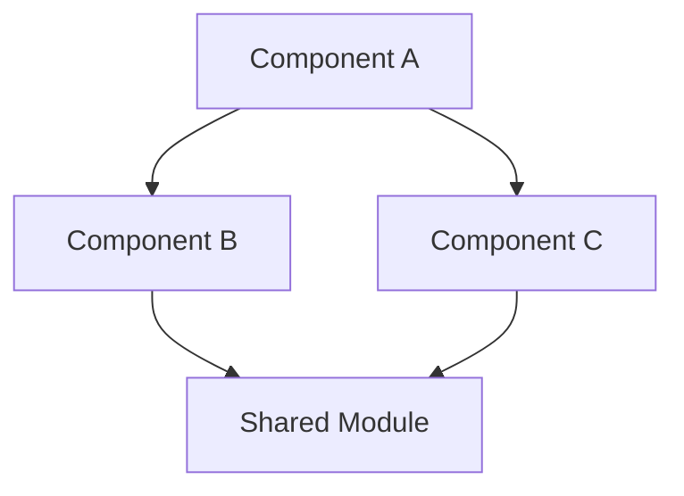
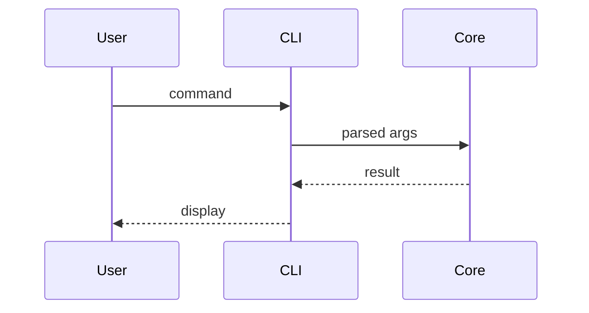

# SKILL: Design Document Generator

> Transform requirements into technical design documents with numbered sections for deterministic GID extraction.

## Purpose

This is Phase 3 of the GID pipeline: Idea → Requirements → **Design** → Graph → Execute.

Design documents define **HOW** the system is built. Every section is numbered so GID task nodes can reference specific sections via `design_ref: "3.2"` for precise context assembly.

## When to Use

- After requirements.md is written and approved (Phase 2)
- When refining an existing design document
- Before running `gid_design` to generate the graph (Phase 4)

## Prerequisites

- Requirements must exist in one of these locations:
  - Master doc: `.gid/docs/requirements.md` (GUARDs + feature index)
  - Feature docs: `.gid/features/{feature}/requirements.md` (per-feature GOALs)
  - Simple project (single feature): `.gid/features/{feature}/requirements.md` only
- **Read ALL requirements first** — check both master (`.gid/docs/`) and feature-level docs (`.gid/features/`) if they exist
- Every design decision should trace back to a GOAL

## Document Size Rule: Feature-Level Splitting

**A single design document MUST NOT exceed ~8 components (sections 3.1-3.N).** If it does, split into feature-level documents.

**Why:** Design docs with 10+ components exceed context limits during implementation. Sub-agents implementing a task need to read the relevant design section — a 15-component monolith forces them to read everything. Smaller, focused docs = better implementation quality.

**Structure for large projects:**

```
.gid/
├── docs/
│   └── architecture.md          ← Master: architecture overview, cross-cutting concerns, component index
└── features/
    ├── auth/design.md           ← 4-6 components for auth
    ├── pipeline/design.md       ← 4-6 components for pipeline
    └── cli/design.md            ← 4-6 components for CLI
```

**Master architecture.md (in `.gid/docs/`) contains:**
- §1 Overview (architecture summary, key trade-offs)
- §2 Architecture (high-level diagram showing feature boundaries)
- §3 Cross-cutting concerns (shared types, error handling, config)
- §4 Feature index with references to feature docs
- §5 Data flow between features
- NO per-feature component details — those live in feature docs

**Each feature design.md contains:**
- §1 Feature overview + requirements coverage (which GOALs this addresses)
- §2 Components (3.1-3.N style, 4-8 components max)
- §3 Internal data flow
- §4 Integration points (references to other features or master doc)
- §5 Guard checks specific to this feature

**When to split:**
- Total components > 8 → split upfront
- If requirements are already split into features → design follows the same structure
- Single feature with 8+ components → that feature should be split further

## Output Location

Depends on project structure:
- **Single feature (≤8 components):** `.gid/features/{feature-name}/design.md`
- **Multi-feature project:** Architecture overview at `.gid/docs/architecture.md` + features at `.gid/features/{feature-name}/design.md`
- **Issue fix designs:** `.gid/issues/{ISS-NNN}/design.md`

The `.gid/features/` location is canonical — `assemble_task_context()` resolves design docs from there via the feature node's `design_doc` metadata.

## The HOW Boundary

Requirements define WHAT. Design defines HOW. This skill produces HOW.

### ✅ Belongs in DESIGN.md (HOW)
```
"Uses Kahn's algorithm with visited set for cycle detection"
"Stores state in SQLite with WAL mode for concurrent reads"
"Merges via git rebase then --no-ff merge to preserve history"
"Context assembled by traversing depends_on edges and extracting heading-matched sections"
```

### ❌ Does NOT belong in DESIGN.md
```
"System detects cycles and rejects cyclic graphs"     → requirement (WHAT)
"CLI responds within 500ms"                            → requirement (WHAT)
"Auth tokens never appear in logs"                     → guard (WHAT)
"We should build a CLI tool for auth management"       → idea/overview (WHY)
```

**Rule of thumb:** If it describes observable behavior without specifying mechanism, it's a requirement. If it specifies the mechanism, it's design.

## Template

```markdown
# Design: {Project Name}

## 1. Overview

{High-level architecture summary. What approach and why.
Key trade-offs made. 2-3 paragraphs max.
Reference GOAL numbers when a design choice directly addresses one.}

## 2. Architecture

{System-level component diagram.}



{Brief explanation. Why this structure.}

## 3. Components

{One subsection per component. This is the core of the design.
Section numbers here (3.1, 3.2, ...) become `design_ref` values in GID tasks.}

### 3.1 {Component Name}

**Responsibility:** {One sentence}

**Interface:**
```rust
pub struct ComponentName { ... }

impl ComponentName {
    pub fn method_a(&self, param: Type) -> Result<Output> { ... }
    pub fn method_b(&mut self, param: Type) -> Result<()> { ... }
}
```

**Key Details:**
- {Algorithm choices, data structure decisions}
- {Constraints, conventions, edge cases}
- {How it connects to other components (imports, calls)}

**Satisfies:** GOAL-1.1, GOAL-1.2

### 3.2 {Component Name}
...

## 4. Data Models

{Core data structures with all fields, types, and validation rules.}

```rust
pub struct ModelName {
    pub field_a: String,
    pub field_b: Option<DateTime>,
    pub field_c: Vec<SubModel>,
}
```

## 5. Data Flow

{How data moves through the system. Sequence diagrams for key operations.}



## 6. Error Handling

{Error types, propagation strategy, user-facing messages, recovery.}

## 7. Testing & Verification

{How to verify the implementation. These verify commands become task `metadata.verify` in GID.}

**Per-component verification:**
| Component | Verify Command | What It Checks |
|-----------|---------------|----------------|
| 3.1 Config | `cargo test --test config_test` | Config load/save, defaults, validation |
| 3.2 Auth | `cargo test --test auth_test` | Profile CRUD, token masking |

**Layer checkpoint:** `cargo check && cargo test`

**Guard checks:**
| Guard | Check Command |
|-------|--------------|
| GUARD-1: Atomic writes | `grep -rn 'fs::write' src/ \| grep -v atomic \| wc -l` → expect 0 |

## 8. File Structure

{Expected file layout after implementation.}

```
src/
├── main.rs          # Entry point (3.1)
├── config.rs        # Configuration (3.2)
├── auth.rs          # Auth management (3.3)
└── error.rs         # Error types (6)
tests/
├── config_test.rs
└── auth_test.rs
```
```

## Section Numbering Rules

**Every section and subsection must have a number.** GID tasks reference sections by number:

```yaml
- id: auth-read-profiles
  metadata:
    design_ref: "3.2"    # → extracts section 3.2 from DESIGN.md
```

**Rules:**
- Top-level: `## 1.`, `## 2.`, ... `## 8.` (always these 8)
- Components: `### 3.1`, `### 3.2`, ... (match component count)
- Sub-components: `#### 3.2.1`, `#### 3.2.2` (when needed)
- Sequential, no gaps, no letters (not 3.a, 3.b)
- **If you add a section, renumber** — never append out-of-order

## Interface Signatures

Sub-agents implement from these signatures. They must be **complete and real** — not pseudocode.

### Rust
```rust
pub fn read_profiles(path: &Path) -> Result<Vec<AuthProfile>>
pub struct AuthProfile { pub name: String, pub token_prefix: String, pub status: ProfileStatus }
pub enum ProfileStatus { Active, Cooldown { expires_at: DateTime<Utc> } }
```

### Python
```python
def read_profiles(path: Path) -> list[AuthProfile]:
@dataclass
class AuthProfile:
    name: str
    token_prefix: str
    status: ProfileStatus
```

### TypeScript
```typescript
function readProfiles(path: string): Promise<AuthProfile[]>
interface AuthProfile { name: string; tokenPrefix: string; status: ProfileStatus }
type ProfileStatus = { kind: 'active' } | { kind: 'cooldown'; expiresAt: Date }
```

**Rules:**
- All public function signatures with full param and return types
- All struct/class definitions with all fields and types
- All enum variants with associated data
- ❌ Never use `...`, `TODO`, `// fill in later`
- ❌ Never write pseudocode — write the actual language syntax

## Component Decomposition

### When to split a component
- It has **2+ distinct responsibilities** (e.g., "auth" does CRUD + token validation → split)
- It would produce a file **>300 lines** when implemented
- Sub-agents would need **>20 turns** to implement it as one task

### When NOT to split
- It's a single struct with a few methods
- Splitting would create artificial interfaces between tightly coupled logic
- The component is already a leaf (no sub-components)

### Size guidance
- Each `### 3.x` section should map to **1-3 GID tasks** later
- If a section would map to 5+ tasks, split into subsections (3.2.1, 3.2.2)
- If a section maps to 0 tasks (pure description, no code), it shouldn't be a component section

### Cross-cutting concerns
Things like logging, config loading, and error types appear everywhere. Handle them:
- **Dedicated section** for the concern itself (error types → section 6)
- **Brief reference** in each component that uses it: "Uses `ProjectError` from §6"
- **Don't repeat** the full error type definition in every component section

## Self-Contained Sections

Each `### 3.x` section must be understandable **in isolation** — a sub-agent reading only section 3.2 (via `design_ref`) should be able to implement it.

### ✅ Good — self-contained
```markdown
### 3.2 Auth Module

**Responsibility:** Manage auth profiles (CRUD, validation, switching).

**Interface:**
pub fn list_profiles(config: &Config) -> Vec<ProfileSummary>
pub fn switch_profile(config: &mut Config, name: &str) -> Result<()>

Config is defined in §3.1: { profiles: Vec<AuthProfile>, active: String }
AuthProfile: { name: String, token: String, provider: String }

**Key Details:**
- Reads from ~/.agentctl/config.toml (see §3.1 for format)
- Token prefix = first 8 chars of token field
- switch_profile writes config back via Config::save()
```

### ❌ Bad — depends on context
```markdown
### 3.2 Auth Module

Handles the auth stuff. Uses the config from above.
See 3.1 for the struct definitions.
```

**Rules:**
- Repeat key type definitions (or summarize: "Config: { profiles, active }")
- State file paths, formats, conventions
- Name connected components explicitly ("calls Config::save() from §3.1")

## Common Mistakes

| Mistake | Why it's bad | Fix |
|---------|-------------|-----|
| Unnumbered subsections | GID can't reference them via `design_ref` | Number everything |
| Pseudocode signatures | Sub-agents implement wrong types | Write real language syntax |
| "See section X" without summary | Sub-agent only gets one section | Inline key info + reference |
| Missing edge cases | Sub-agent doesn't handle them | List edge cases in Key Details |
| No `Satisfies:` line | Traceability breaks | Every component traces to GOALs |
| Business requirements in design | Mixing WHAT and HOW | Move to requirements.md |
| Diagram without explanation | Ambiguous relationships | Always explain diagrams in text |
| Component too large | Maps to 5+ tasks, too complex | Split into 3.x.1, 3.x.2 subsections |

## Mermaid Diagrams

### When to use which type

| Diagram | Use for | Example |
|---------|---------|---------|
| `graph TD` | Architecture, component relationships, data dependencies | §2 Architecture |
| `sequenceDiagram` | Request flows, multi-step operations, async interactions | §5 Data Flow |
| `classDiagram` | Data model relationships (rarely needed if structs are clear) | §4 Data Models |
| `stateDiagram-v2` | State machines, lifecycle transitions | Task states, connection states |

### Rules
- Every diagram has explanatory text below it
- Nodes use descriptive labels, not single letters
- Keep diagrams focused — max ~10 nodes/participants
- Split complex flows into multiple diagrams rather than one giant one

## Process

### Step 1: Read Requirements
- Check for multi-doc structure: `ls .gid/features/` — if feature dirs exist, read ALL feature requirements
- Single doc: load `.gid/requirements.md` or `REQUIREMENTS.md`
- Multi-doc: load master `.gid/requirements.md` (GUARDs + feature index) + each `.gid/features/{feature}/requirements.md` (GOALs)
- Map every GOAL and GUARD — each must be addressed in the design
- For multi-feature projects: each feature's design doc should address that feature's GOALs
- `engram recall "{project} architecture decisions"` for past context

### Step 2: Decompose into Components
- Identify 3-8 components from requirements
- Define interfaces FIRST, then details
- Check: does each component map to 1-3 tasks? If more, split.

### Step 3: Write the Document
- Follow the template (sections 1-8, all required)
- Number every section and subsection
- Complete interface signatures in the target language
- Add Mermaid diagrams for architecture (§2) and data flow (§5)

### Step 4: Ground Truth Verification ⚠️ CRITICAL

**This step prevents the #1 source of multi-round review cycles: unverified assumptions about existing code.**

Before finalizing, for EVERY reference to existing code in the design:

#### 4a. Verify existing APIs/functions
For every function, struct, trait, or method the design references from the existing codebase:
- **Read the actual source file** — use `search_files` or `read_file` to find it
- **Record the actual signature** — params, return type, generics, trait bounds
- **Cite the source**: add `(verified: src/foo.rs:123)` after the reference in the design doc

```markdown
### ❌ BAD — unverified assumption
"calls `merge_project_layer()` which handles deduplication"

### ✅ GOOD — verified against source
"calls `merge_project_layer(graph: &mut Graph, incoming: Vec<Node>, edges: Vec<Edge>)` 
which replaces all project-layer nodes and edges (verified: src/unified.rs:89). 
Note: does NOT deduplicate edges — caller must handle dedup."
```

#### 4b. Verify behavior assumptions
If the design says "function X does Y" or "feature X supports Y":
- **Read the implementation**, not just the signature
- **Check for what it does NOT do** — missing behavior is where bugs hide
- Things to verify: Does it handle edge cases? Does it deduplicate? Does it validate input? Does it preserve existing data?

#### 4c. Verify dependencies exist
For every external crate, library, or tool the design assumes:
- Check `Cargo.toml` / `package.json` — is it already a dependency?
- If not, explicitly note: "Requires adding `notify` crate to Cargo.toml"

#### 4d. Verify effort estimates
If the design says "~20 lines" or "small change":
- **Read the file that needs changing** — how many lines is the function? What else calls it?
- **Check for hidden complexity** — does the "small change" require updating 5 call sites?
- Be honest about effort. Underestimating causes "just a quick fix" to become a multi-hour rabbit hole.

#### 4e. Cite sources
Every verified claim gets a citation:
- `(verified: src/graph.rs:245)` — line number
- `(verified: Cargo.toml, notify not present)` — absence
- `(verified: search for "merge_feature" returned 0 results)` — function doesn't exist yet

**If you cannot verify a claim (no access to source, function doesn't exist yet, etc.), explicitly mark it as unverified:**
```markdown
⚠️ UNVERIFIED: Assumes `extract_incremental()` preserves the code layer.
   Need to verify: does it merge or overwrite?
```

### Step 5: Self-Review Checklist
Before presenting, verify:
- [ ] **Ground truth**: Every reference to existing code has been verified against source (Step 4)
- [ ] **No unverified assumptions**: Any unverified claims are explicitly marked with ⚠️
- [ ] **Coverage**: Every GOAL (across all feature docs) is addressed by at least one component (`Satisfies:` line)
- [ ] **Guards**: Every GUARD (from master doc) is accounted for (error handling, component constraints, or §7 guard checks)
- [ ] **Signatures complete**: No `...`, no `TODO`, no pseudocode
- [ ] **Numbering**: Sequential, no gaps (1-8 top-level, 3.1-3.N components)
- [ ] **Self-contained**: Each 3.x section is understandable without reading other sections
- [ ] **Diagrams**: Every diagram has explanatory text; diagrams render correctly
- [ ] **Verify commands**: §7 has per-component verify commands (will become task `metadata.verify`)
- [ ] **File structure**: §8 maps files to component sections
- [ ] **HOW not WHAT**: No requirements restated without implementation detail added
- [ ] **Decomposition**: No component maps to >4 tasks (split if so)

### Step 6: Present for Review
- Show the complete document
- Ask: "Does this architecture make sense? Any components missing?"
- Iterate until approved

### Step 7: Save
- Write to `DESIGN.md` (or `docs/DESIGN.md` for internal)
- Store in engram: `engram add --type factual --importance 0.7 "Design written for {project}: {N} components, sections 3.1-3.{N}"`
- Log in daily memory file

## Traceability

The chain flows through this document:

```
requirements.md          →  GOAL-1.1, GOAL-1.2
  ↓
DESIGN.md §3.2           →  "Auth Module" satisfies GOAL-1.1, GOAL-1.2
  ↓
.gid/graph.yml task      →  design_ref: "3.2", satisfies: ["GOAL-1.1"]
  ↓
Sub-agent implementation  →  reads §3.2 content, implements interface
  ↓
Verification             →  runs verify command from §7 table
```

Every GOAL must be traceable through this chain. If a GOAL has no corresponding design section, either the design is incomplete or the GOAL is out of scope.
